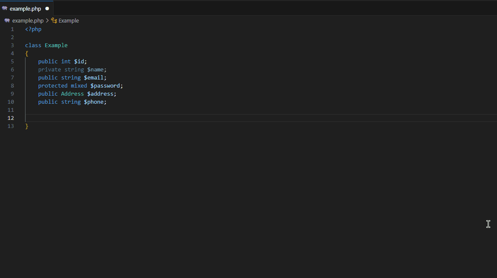

# PHP Getter & Setter and Constructor for Visual Studio Code

I was inspired by [this](https://www.jetbrains.com/idea/guide/tips/generate-getters-and-setters/)  feature of IntelliJ.

## Commands

`phpgsc` allows you to quickly generate constructor, getter and setter methods with commands.

* `phpgsc: Constructor`
* `phpgsc: Getter`
* `phpgsc: Setter`

## Usage

Examples of usages:

* `F1` -> `phpgsc: Constructor`
* `Context Menu` -> `phpgsc: Constructor`

You can access this commands from context menu.

